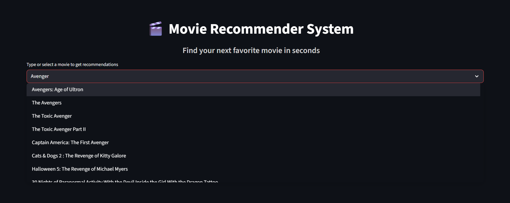

#  Movie Recommender System

This project is an interactive **Movie Recommender System** built using **Python**, **Machine Learning**, and a user-friendly **Streamlit** interface. It provides personalized movie recommendations based on the user's selection by leveraging content-based filtering techniques.

At its core, the system analyzes movie features and computes a similarity matrix using **Cosine Similarity**. Once a user selects a movie, the app quickly identifies and displays a list of similar movies, along with their posters and movie description including *Genres*,*Release data*,*Ratings* and *Overview* using data fetched from the **TMDB API**. 

Designed with simplicity, speed, and scalability in mind, this project demonstrates how machine learning can be integrated with an intuitive frontend to create a seamless user experience.


<p align="center">
  
</p>

---

##  Features

-  **Content-based filtering** using cosine similarity
-  Interactive and minimal UI built with **Streamlit**
-  Precomputed similarity matrix for fast recommendations
-  Movie posters fetched via the **TMDB API**
-  Modular and well-organized code in `src/` folder

---

##  How It Works

1. The system uses a preprocessed dataset of movies with relevant features.
2. A similarity matrix is generated using vectorized content features.
3. When a user selects a movie, the system finds the top 5 most similar movies.
4. Posters and titles of recommended movies are displayed beautifully.

---

## 📁 Folder Structure
```
├── src/ # Source code (recommendation logic)
├── screenshots/ # UI screenshots
├── app.py # Streamlit UI app
├── Movie Recommendation System.ipynb # Jupyter notebook for training and processing
├── requirements.txt # Python dependencies
├── .gitignore
└── README.md
```


---

##  Dataset & Artifacts

Due to GitHub’s file size limits, the following files are **not included** in this repository:
- `movie_list.pkl` and `similarity.pkl` (stored in `artifacts/`)
- Dataset `.csv` files (stored in `data/`)

###  Download from:
👉 [**Click here to download dataset and model files**](https://www.kaggle.com/datasets/tmdb/tmdb-movie-metadata)

After downloading:
- Place dataset files inside a folder named `data/`
- Place `movie_list.pkl` and `similarity.pkl` inside a folder named `artifacts/`

---

##  Getting Started

1. **Clone the repository**
```bash
git clone https://github.com/your-username/movie-recommendation-system.git
cd movie-recommendation-system
```
2.**Install dependencies**
```bash
pip install -r requirements.txt
```
3.**Run the Streamlit app**
```bash
streamlit run app.py
```

##  Visuals

### 🔹 Top View
<p align="center">
  
</p>

### 🔹 Full View
<p align="center">
  
</p>

### 🔹 Recommendation Extended View
<p align="center">
  
</p>

---

##  Technologies Used

- Python  
- Pandas  
- Scikit-learn  
- Streamlit  
- TMDB API


Thanks for checking out this project! Your feedback and suggestions are always welcome.


